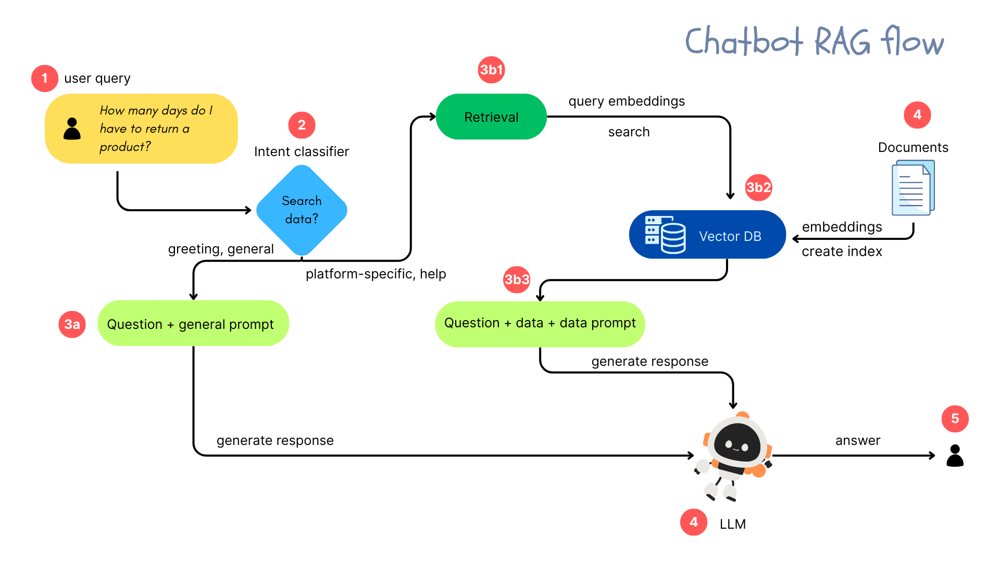

# aichatbot

This repository provides an end-to-end widget for an open-source AI chatbot, built on a Retrieval-Augmented Generation (RAG) architecture.
### Structure

- **`server/`**: Contains a Flask-based backend where the chatbot logic is implemented.
- **`chat_widget/`**: Contains a React-based chat widget that can be embedded into web applications.

### Architecture Components

- **Documents**: Transformed in embeddings and stored in a vector database.
- **Retriever**: Handles search queries in the vector DB.
- **Intent Classifier**: Determines whether a DB search is needed based on user input.
- **LLM (Large Language Model)**: Generates the final response.

## Configuration Steps for Custom Dataset

To make this chatbot work with any dataset, follow these steps:

1. **Update Data Source**  
   In `/server/data/config.json`, set the `data_filepath` to your own `.csv` or `.json` file.

2. **Adjust Fields to Index**  
    Modify the list of fields to index for retrieval (based on your data structure) in `/server/data/fields_to_index.json`.  
   Optionally, add field names to track the source of the information.

3. **Update Intent Classifier Dataset**  
   Replace the training texts in `/server/intentClassifier/intent_texts.json` with ones relevant to your domain.  
   Retrain the intent classifier by running `/server/intentClassifier/fineTune.ipynb`.

4. **Modify Retrieval Threshold**  
   Experiment and set a similarity threshold that suits your use case (`/server/retrieval.py`).

5. **Update LLM Prompts**  
   Customize the LLM agents' prompts (`/server/generator.py`) to reflect their new roles (not Nespresso support).  
   Update the domain they can discuss and specify the type of help they can provide.

Want to learn more or share your thoughts? Connect with us on [LinkedIn](https://www.linkedin.com/company/hd-tech-labs/).